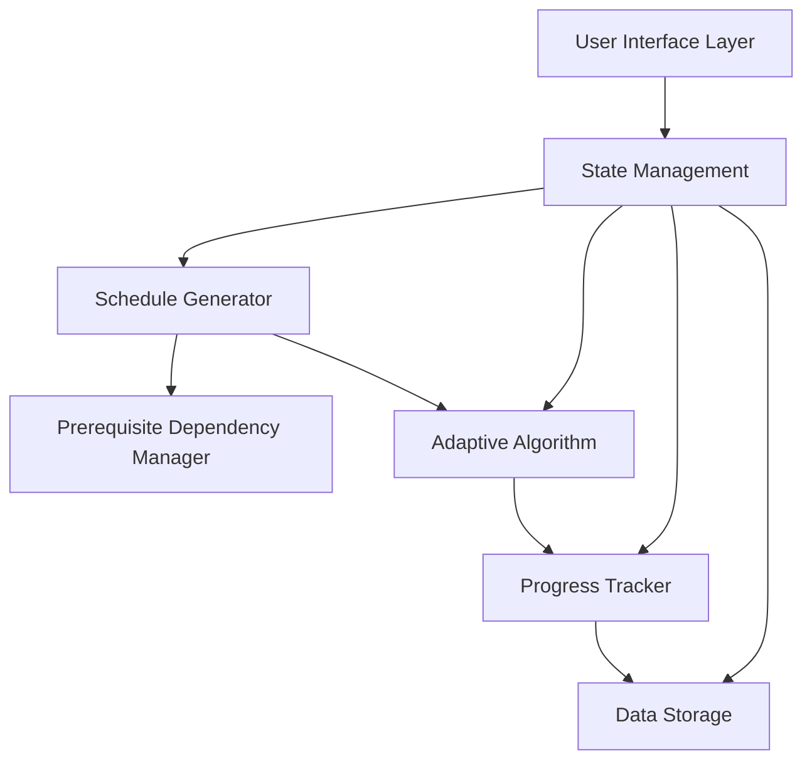
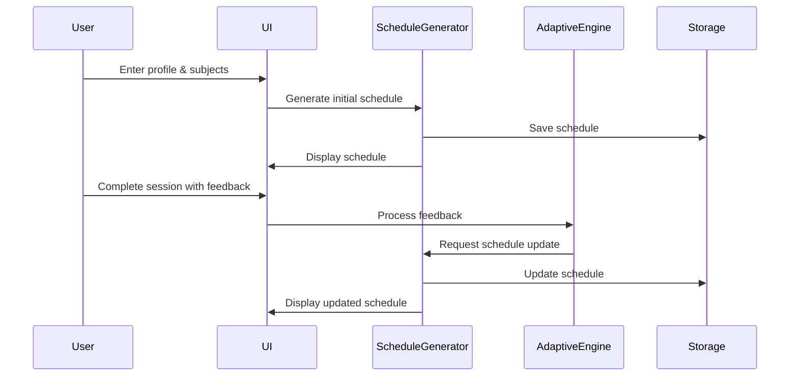

# Design Document: AI Study Planner for Engineering Students

## Overview

The AI Study Planner is a web-based application that generates personalized, adaptive study schedules for engineering students. The system uses rule-based algorithms combined with adaptive heuristics to balance cognitive load, respect prerequisite dependencies, prioritize based on deadlines and confidence levels, and continuously adapt to student feedback.

### Key Design Principles

1. **Explainability First**: Every scheduling decision must be traceable and understandable
2. **Immediate Value**: Students should see value within 2 minutes of setup
3. **Adaptive by Default**: The system learns from student behavior without explicit configuration
4. **Cognitive Load Awareness**: Schedule high-effort tasks during peak energy times
5. **Fail-Safe**: Graceful degradation when constraints cannot be perfectly satisfied

### Technology Stack (Recommended)

- **Frontend**: React with TypeScript for type safety and component reusability
- **State Management**: Redux or Zustand for complex schedule state
- **Styling**: Tailwind CSS for rapid UI development
- **Data Persistence**: LocalStorage for MVP, with IndexedDB for scalability
- **Calendar Visualization**: FullCalendar or React Big Calendar
- **Date/Time Handling**: date-fns or Day.js (lightweight alternatives to Moment.js)
- **Notifications**: Browser Notification API
- **Testing**: Jest for unit tests, React Testing Library for component tests

## Architecture

### High-Level Architecture



### Component Architecture

The system follows a layered architecture:

1. **Presentation Layer**: React components for UI rendering
2. **Application Layer**: Business logic for scheduling, adaptation, and progress tracking
3. **Domain Layer**: Core entities (Student, Subject, Topic, Session, Schedule)
4. **Infrastructure Layer**: Data persistence, notifications, and external integrations

### Data Flow



## Components and Interfaces

### Core Domain Models

#### Student Profile
```typescript
interface StudentProfile {
  id: string;
  name: string;
  college: string;
  branch: EngineeringBranch;
  graduationYear: number;
  email: string;
  studyAvailability: StudyAvailability;
  preferredStudyTime: TimePreference;
  targetCompletionDate: Date;
  createdAt: Date;
  updatedAt: Date;
}

interface StudyAvailability {
  weekdayHours: number;  // Hours per weekday
  weekendHours: number;  // Hours per weekend day
}

enum TimePreference {
  MORNING = 'morning',      // 6am - 12pm
  AFTERNOON = 'afternoon',  // 12pm - 6pm
  EVENING = 'evening',      // 6pm - 10pm
  NIGHT = 'night'          // 10pm - 2am
}

enum EngineeringBranch {
  CSE = 'Computer Science',
  ECE = 'Electronics & Communication',
  MECHANICAL = 'Mechanical',
  CIVIL = 'Civil',
  ELECTRICAL = 'Electrical',
  OTHER = 'Other'
}
```

#### Subject and Topic
```typescript
interface Subject {
  id: string;
  name: string;
  credits: number;
  topics: Topic[];
  strongAreas: string[];
  weakAreas: string[];
  confidenceLevel: ConfidenceLevel;  // 1-5
  importance: SubjectImportance;
  deadlines: Deadline[];
  isInterestSubject: boolean;  // True for personal interest subjects
  createdAt: Date;
  updatedAt: Date;
}

interface Topic {
  id: string;
  subjectId: string;
  name: string;
  cognitiveLoad: CognitiveLoad;
  prerequisites: string[];  // Array of topic IDs
  estimatedHours: number;
  completedHours: number;
  confidenceLevel: ConfidenceLevel;
  isWeak: boolean;
  lastStudied?: Date;
  nextReviewDate?: Date;  // For spaced repetition
}

enum CognitiveLoad {
  LOW = 'low',       // Revision, easy concepts
  MEDIUM = 'medium', // Standard learning
  HIGH = 'high'      // Complex new concepts
}

enum ConfidenceLevel {
  VERY_LOW = 1,
  LOW = 2,
  MEDIUM = 3,
  HIGH = 4,
  VERY_HIGH = 5
}

enum SubjectImportance {
  LOW = 'low',
  MEDIUM = 'medium',
  HIGH = 'high',
  CRITICAL = 'critical'
}

interface Deadline {
  id: string;
  type: DeadlineType;
  name: string;
  date: Date;
  relatedTopics: string[];  // Topic IDs
}

enum DeadlineType {
  EXAM = 'exam',
  ASSIGNMENT = 'assignment',
  QUIZ = 'quiz',
  PROJECT = 'project'
}
```

#### Study Session and Schedule
```typescript
interface StudySession {
  id: string;
  topicId: string;
  subjectId: string;
  scheduledDate: Date;
  startTime: string;  // HH:mm format
  duration: number;   // Minutes
  sessionType: SessionType;
  cognitiveLoad: CognitiveLoad;
  status: SessionStatus;
  actualStartTime?: Date;
  actualEndTime?: Date;
  difficultyFeedback?: DifficultyFeedback;
  notes?: string;
}

enum SessionType {
  LEARNING = 'learning',      // New concept
  REVISION = 'revision',      // Review
  PRACTICE = 'practice',      // Problem solving
  DRILL = 'drill',           // Weak topic micro-session
  SPACED_REP = 'spaced_rep'  // Spaced repetition
}

enum SessionStatus {
  SCHEDULED = 'scheduled',
  IN_PROGRESS = 'in_progress',
  COMPLETED = 'completed',
  MISSED = 'missed',
  RESCHEDULED = 'rescheduled'
}

enum DifficultyFeedback {
  EASY = 'easy',
  MEDIUM = 'medium',
  HARD = 'hard'
}

interface Schedule {
  id: string;
  studentId: string;
  sessions: StudySession[];
  generatedAt: Date;
  lastUpdatedAt: Date;
  version: number;
  metadata: ScheduleMetadata;
}

interface ScheduleMetadata {
  totalHours: number;
  subjectDistribution: Map<string, number>;  // Subject ID -> hours
  bufferTimePercentage: number;
  completionDate: Date;
  feasibilityScore: number;  // 0-100
}
```

#### Progress Tracking
```typescript
interface ProgressSnapshot {
  id: string;
  studentId: string;
  timestamp: Date;
  subjectProgress: Map<string, SubjectProgress>;
  overallProgress: number;  // 0-100
  weeklyStats: WeeklyStats;
}

interface SubjectProgress {
  subjectId: string;
  topicProgress: Map<string, TopicProgress>;
  overallConfidence: number;
  hoursSpent: number;
  hoursRemaining: number;
  completionPercentage: number;
}

interface TopicProgress {
  topicId: string;
  completionPercentage: number;  // 0-100
  confidenceLevel: ConfidenceLevel;
  hoursSpent: number;
  sessionsCompleted: number;
  lastDifficultyFeedback?: DifficultyFeedback;
}

interface WeeklyStats {
  weekStartDate: Date;
  sessionsScheduled: number;
  sessionsCompleted: number;
  sessionsMissed: number;
  totalHoursStudied: number;
  averageDifficulty: number;
  confidenceImprovement: number;
}
```

### Core Algorithms

#### 1. Schedule Generation Algorithm

```typescript
interface ScheduleGeneratorConfig {
  student: StudentProfile;
  subjects: Subject[];
  startDate: Date;
  endDate: Date;
}

class ScheduleGenerator {
  /**
   * Main entry point for schedule generation
   */
  generateSchedule(config: ScheduleGeneratorConfig): Schedule {
    // Step 1: Validate inputs and calculate total available hours
    const totalHours = this.calculateAvailableHours(config);
    
    // Step 2: Build prerequisite graph and perform topological sort
    const topicOrder = this.resolvePrerequisites(config.subjects);
    
    // Step 3: Calculate priority scores for all topics
    const prioritizedTopics = this.calculatePriorities(
      topicOrder,
      config.subjects,
      config.endDate
    );
    
    // Step 4: Allocate time based on credits, importance, and confidence
    const timeAllocations = this.allocateTime(
      prioritizedTopics,
      totalHours,
      config.subjects
    );
    
    // Step 5: Generate sessions with cognitive load balancing
    const sessions = this.generateSessions(
      timeAllocations,
      config.student.studyAvailability,
      config.student.preferredStudyTime,
      config.startDate,
      config.endDate
    );
    
    // Step 6: Add buffer time and validate feasibility
    const finalSchedule = this.addBufferTime(sessions, 0.15);  // 15% buffer
    
    return finalSchedule;
  }
  
  /**
   * Calculate total available study hours between start and end date
   */
  private calculateAvailableHours(config: ScheduleGeneratorConfig): number {
    const { weekdayHours, weekendHours } = config.student.studyAvailability;
    const days = this.getDaysBetween(config.startDate, config.endDate);
    
    let totalHours = 0;
    for (const day of days) {
      totalHours += this.isWeekend(day) ? weekendHours : weekdayHours;
    }
    
    return totalHours;
  }
  
  /**
   * Resolve prerequisite dependencies using topological sort
   */
  private resolvePrerequisites(subjects: Subject[]): Topic[] {
    const graph = this.buildPrerequisiteGraph(subjects);
    return this.topologicalSort(graph);
  }
  
  /**
   * Calculate priority score for each topic
   * Priority = (1 - confidence/5) * importanceWeight * deadlineUrgency * cognitiveLoadFactor
   */
  private calculatePriorities(
    topics: Topic[],
    subjects: Subject[],
    targetDate: Date
  ): PrioritizedTopic[] {
    return topics.map(topic => {
      const subject = subjects.find(s => s.id === topic.subjectId)!;
      
      // Confidence factor: lower confidence = higher priority
      const confidenceFactor = (6 - topic.confidenceLevel) / 5;
      
      // Importance weight
      const importanceWeight = this.getImportanceWeight(subject.importance);
      
      // Deadline urgency
      const deadlineUrgency = this.calculateDeadlineUrgency(
        subject.deadlines,
        topic.id,
        targetDate
      );
      
      // Cognitive load factor (high load topics need more time)
      const cognitiveLoadFactor = this.getCognitiveLoadFactor(topic.cognitiveLoad);
      
      const priorityScore = 
        confidenceFactor * importanceWeight * deadlineUrgency * cognitiveLoadFactor;
      
      return {
        topic,
        priorityScore,
        subject
      };
    }).sort((a, b) => b.priorityScore - a.priorityScore);
  }
  
  /**
   * Allocate study time across topics
   */
  private allocateTime(
    prioritizedTopics: PrioritizedTopic[],
    totalHours: number,
    subjects: Subject[]
  ): Map<string, number> {
    const allocations = new Map<string, number>();
    
    // Calculate base allocation by credits
    const totalCredits = subjects.reduce((sum, s) => sum + s.credits, 0);
    
    for (const { topic, subject } of prioritizedTopics) {
      // Base allocation from credits
      const creditShare = (subject.credits / totalCredits) * totalHours;
      
      // Adjust for confidence (weak topics get more time)
      const confidenceMultiplier = (6 - topic.confidenceLevel) / 5;
      
      // Adjust for cognitive load
      const loadMultiplier = this.getCognitiveLoadFactor(topic.cognitiveLoad);
      
      const allocatedHours = creditShare * confidenceMultiplier * loadMultiplier;
      allocations.set(topic.id, allocatedHours);
    }
    
    // Normalize to fit total hours
    return this.normalizeAllocations(allocations, totalHours);
  }
  
  /**
   * Generate actual study sessions with time slots
   */
  private generateSessions(
    timeAllocations: Map<string, number>,
    availability: StudyAvailability,
    preferredTime: TimePreference,
    startDate: Date,
    endDate: Date
  ): StudySession[] {
    const sessions: StudySession[] = [];
    const days = this.getDaysBetween(startDate, endDate);
    
    // Convert allocations to sessions
    for (const [topicId, hours] of timeAllocations) {
      const topic = this.getTopicById(topicId);
      const sessionDuration = this.getOptimalSessionDuration(topic.cognitiveLoad);
      const numSessions = Math.ceil((hours * 60) / sessionDuration);
      
      // Distribute sessions across available days
      for (let i = 0; i < numSessions; i++) {
        const day = this.selectOptimalDay(days, topic, preferredTime);
        const timeSlot = this.selectOptimalTimeSlot(day, topic, preferredTime);
        
        sessions.push({
          id: generateId(),
          topicId: topic.id,
          subjectId: topic.subjectId,
          scheduledDate: day,
          startTime: timeSlot,
          duration: sessionDuration,
          sessionType: SessionType.LEARNING,
          cognitiveLoad: topic.cognitiveLoad,
          status: SessionStatus.SCHEDULED
        });
      }
    }
    
    return this.sortSessionsByDate(sessions);
  }
  
  /**
   * Select optimal time slot based on cognitive load and preferences
   */
  private selectOptimalTimeSlot(
    day: Date,
    topic: Topic,
    preferredTime: TimePreference
  ): string {
    // High cognitive load → preferred time
    // Medium cognitive load → any available time
    // Low cognitive load → non-preferred time
    
    if (topic.cognitiveLoad === CognitiveLoad.HIGH) {
      return this.getPreferredTimeSlot(preferredTime);
    } else if (topic.cognitiveLoad === CognitiveLoad.LOW) {
      return this.getNonPreferredTimeSlot(preferredTime);
    } else {
      return this.getAnyAvailableTimeSlot(day);
    }
  }
}
```

#### 2. Adaptive Rescheduling Algorithm

```typescript
class AdaptiveScheduler {
  /**
   * Adapt schedule based on session feedback
   */
  adaptSchedule(
    currentSchedule: Schedule,
    completedSession: StudySession,
    feedback: DifficultyFeedback
  ): Schedule {
    const updatedSchedule = { ...currentSchedule };
    
    // Step 1: Update time estimates based on feedback
    if (feedback === DifficultyFeedback.HARD) {
      this.increaseTopicTime(updatedSchedule, completedSession.topicId, 1.3);
    } else if (feedback === DifficultyFeedback.EASY) {
      this.decreaseTopicTime(updatedSchedule, completedSession.topicId, 0.8);
    }
    
    // Step 2: Reschedule future sessions
    const futureSessions = this.getFutureSessions(updatedSchedule);
    const rescheduled = this.regenerateSessions(futureSessions);
    
    // Step 3: Maintain prerequisite ordering
    const validated = this.validatePrerequisites(rescheduled);
    
    return validated;
  }
  
  /**
   * Handle missed session rescheduling
   */
  rescheduleMissedSession(
    schedule: Schedule,
    missedSession: StudySession
  ): Schedule {
    // Find next available slot
    const nextSlot = this.findNextAvailableSlot(schedule, missedSession);
    
    // Create rescheduled session
    const rescheduled: StudySession = {
      ...missedSession,
      id: generateId(),
      scheduledDate: nextSlot.date,
      startTime: nextSlot.time,
      status: SessionStatus.RESCHEDULED
    };
    
    // Insert into schedule maintaining order
    return this.insertSession(schedule, rescheduled);
  }
  
  /**
   * Detect and respond to burnout signals
   */
  detectAndHandleBurnout(
    schedule: Schedule,
    recentSessions: StudySession[]
  ): Schedule {
    const consecutiveMissed = this.countConsecutiveMissed(recentSessions);
    const consecutiveHard = this.countConsecutiveHard(recentSessions);
    
    if (consecutiveMissed >= 3 || consecutiveHard >= 5) {
      // Reduce workload by 25%
      return this.reduceWorkload(schedule, 0.25);
    }
    
    return schedule;
  }
  
  /**
   * Detect positive momentum and increase difficulty
   */
  detectMomentum(
    schedule: Schedule,
    recentSessions: StudySession[]
  ): Schedule {
    const consecutiveCompleted = this.countConsecutiveCompleted(recentSessions);
    
    if (consecutiveCompleted >= 7) {
      // Slightly increase session depth
      return this.increaseSessionDepth(schedule, 1.1);
    }
    
    return schedule;
  }
}
```

#### 3. Prerequisite Dependency Manager

```typescript
class PrerequisiteManager {
  /**
   * Build directed acyclic graph (DAG) of topic dependencies
   */
  buildDependencyGraph(subjects: Subject[]): DependencyGraph {
    const graph = new Map<string, string[]>();
    
    for (const subject of subjects) {
      for (const topic of subject.topics) {
        graph.set(topic.id, topic.prerequisites);
      }
    }
    
    // Validate no cycles
    if (this.hasCycle(graph)) {
      throw new Error('Circular prerequisite dependency detected');
    }
    
    return graph;
  }
  
  /**
   * Topological sort using Kahn's algorithm
   */
  topologicalSort(graph: DependencyGraph): string[] {
    const inDegree = new Map<string, number>();
    const queue: string[] = [];
    const result: string[] = [];
    
    // Calculate in-degrees
    for (const [node, deps] of graph) {
      inDegree.set(node, deps.length);
      if (deps.length === 0) {
        queue.push(node);
      }
    }
    
    // Process nodes with no dependencies
    while (queue.length > 0) {
      const node = queue.shift()!;
      result.push(node);
      
      // Reduce in-degree for dependent nodes
      for (const [dependent, deps] of graph) {
        if (deps.includes(node)) {
          const newDegree = inDegree.get(dependent)! - 1;
          inDegree.set(dependent, newDegree);
          
          if (newDegree === 0) {
            queue.push(dependent);
          }
        }
      }
    }
    
    return result;
  }
  
  /**
   * Calculate readiness score for a topic
   */
  calculateReadinessScore(
    topicId: string,
    completedTopics: Set<string>,
    topicConfidence: Map<string, ConfidenceLevel>,
    graph: DependencyGraph
  ): number {
    const prerequisites = graph.get(topicId) || [];
    
    if (prerequisites.length === 0) {
      return 100;  // No prerequisites
    }
    
    let totalScore = 0;
    for (const prereqId of prerequisites) {
      // Check if completed
      if (!completedTopics.has(prereqId)) {
        return 0;  // Not ready if any prerequisite incomplete
      }
      
      // Factor in confidence level
      const confidence = topicConfidence.get(prereqId) || ConfidenceLevel.VERY_LOW;
      totalScore += (confidence / 5) * 100;
    }
    
    return totalScore / prerequisites.length;
  }
  
  /**
   * Validate schedule maintains prerequisite ordering
   */
  validateScheduleOrder(
    schedule: Schedule,
    graph: DependencyGraph
  ): boolean {
    const topicOrder = new Map<string, number>();
    
    // Record order of topics in schedule
    schedule.sessions.forEach((session, index) => {
      if (!topicOrder.has(session.topicId)) {
        topicOrder.set(session.topicId, index);
      }
    });
    
    // Check all prerequisites come before dependents
    for (const [topicId, prerequisites] of graph) {
      const topicIndex = topicOrder.get(topicId);
      if (topicIndex === undefined) continue;
      
      for (const prereqId of prerequisites) {
        const prereqIndex = topicOrder.get(prereqId);
        if (prereqIndex === undefined || prereqIndex >= topicIndex) {
          return false;  // Prerequisite violation
        }
      }
    }
    
    return true;
  }
}
```

## Data Models

### Storage Schema

The application uses a normalized data structure for efficient querying and updates:

```typescript
interface AppState {
  student: StudentProfile | null;
  subjects: Map<string, Subject>;
  topics: Map<string, Topic>;
  schedule: Schedule | null;
  sessions: Map<string, StudySession>;
  progress: ProgressSnapshot[];
  settings: AppSettings;
}

interface AppSettings {
  notificationsEnabled: boolean;
  notificationLeadTime: number;  // Minutes before session
  theme: 'light' | 'dark';
  studyMode: 'learning' | 'exam';
  enableInterleaving: boolean;
  enableSpacedRepetition: boolean;
}
```

### Data Persistence Strategy

**LocalStorage (MVP)**:
- Store serialized AppState
- Automatic save on every state change
- Size limit: ~5-10MB (sufficient for MVP)

**IndexedDB (Future)**:
- Structured storage for larger datasets
- Support for offline-first architecture
- Query capabilities for analytics

```typescript
class StorageService {
  private readonly STORAGE_KEY = 'ai_study_planner_state';
  
  saveState(state: AppState): void {
    try {
      const serialized = JSON.stringify(state);
      localStorage.setItem(this.STORAGE_KEY, serialized);
    } catch (error) {
      console.error('Failed to save state:', error);
      // Handle quota exceeded
    }
  }
  
  loadState(): AppState | null {
    try {
      const serialized = localStorage.getItem(this.STORAGE_KEY);
      return serialized ? JSON.parse(serialized) : null;
    } catch (error) {
      console.error('Failed to load state:', error);
      return null;
    }
  }
  
  clearState(): void {
    localStorage.removeItem(this.STORAGE_KEY);
  }
}
```

